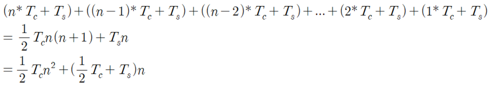
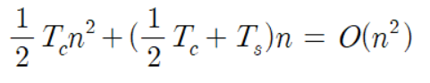
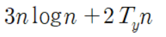

# 알고리즘이란?

## 알고리즘

> 계산이나 작업을 수행하는 순서. 레시피와 비슷하지만 레시피와 다르게 구체적이고 엄격하게 기술됨

### 컴퓨터가 알 수 있게 해법을 작성하는 알고리즘 설계

컴퓨터는 기본 명령을 고속으로 수행할 수 있는 강력한 능력이 있지만 복잡한 명령을 실행하지는 못함. 컴퓨터가 실행할 수 있드록 기본명령을 조합해 작성하는 것이 알고리즘을 설계하는 것.

## 알고리즘을 선택하는 방법

- 사람이 이해하기 쉬운 알고리즘
- 저장 공간을 적게 사용하는 알고리즘
- 가장 중요한 건 계산시간(입력이 주어진 후에 답이 나올 때까지 걸리는 시간)

# 계산 시간 측정 방법

## 입력 크기와 계산 시간의 관계 파악

알고리즘 실행 시간은 같은 알고리즘이라도 입력 크기에 따라 크게 다름. 다른 알고리즘 간 실행 시간 차이 뿐만 아니라 같은 알고리즘에서 입력 크기에 따라 계산 시간이 어떻게 변하는지를 파악하는 것도 무척 중요함

## 계산 시간을 구하는 방법

프로그램을 작성해 컴퓨터에서 돌려보고 실제로 걸린 시간을 측정해볼 수 있지만 컴퓨터마다 측정 시간이 다 다르기 때문에 알고리즘 평가 척도로 사용하기는 어려움

⇒ 알고리즘의 포함되는 기본 동작의 개수를 계산. 적절한 기본 동작을 정의하고 알고리즘이 완료될 때까지 몇 번 반복하는가를 계산.

### 선택정렬의 계산 시간 구하기

```c
(1) 수열에서 최솟값을 찾는다
(2) 찾은 최솟값을 수열의 가장 왼쪽 숫자와 교환하고 정렬할 수열에서 제외한다. 다시(1)로 돌아간다
```

수열에 숫자가 n개 있다면 (1) 최솟값을 찾는 과정은 숫자 n개를 확인.

총 소요시간



## 계산 시간을 표현하는 방법

$T_s$와 $T_c$는 기본 동작의 소요시간으로 입력값이나 크기에 영향을 받지 않음. 위 식에서 입력에의해 변하는 것은 수열의 길이 n. n이 커지면 커질 수록 식에서 $n^2$의 크기가 매우 커지는 반면, 다른 부분은 상대적으로 작아짐. ⇒ 식에서 가장 큰 영향을 주는 부분은 $n^2$. 따라서 다른 부분을 생략하면 다음과 같이 식을 간소화할 수 있음.



위 식을 해석하면 선택 정렬의 실행 시간은 입력 수열의 크기 n의 2승(제곱)에 비례한다고 할 수 있음.

마찬가지로 어떤 알고리즘의 계산량이 다음과 같다면 $O(n^3)$이라고 간략하게 표현할 수 있음.

그리고 다음 식의 경우는 O(n log n)이라고 표현



O는 ‘중요한 항 이외의 항은 무시한다’라는 의미의 기호.

- O($n^2$)란 계산 시간이 최악의 경우 $n^2$의 정수배가 된다는 의미

# 1-1. 데이터 구조란?

## 데이터의 순서와 위치관계를 결정한다.

컴퓨터는 데이터를 메모리에 저장. 메모리는 다음 그림처럼 상자가 일렬로 나열된 형태라고 생각할 수 있으며, 상자하나에 데이터 하나가 담기는 형태.

데이터를 메모리에 저장할 때, 데이터의 순서나 위치 관계를 규정한 것이 데이터 구조.

## 전화번호부의 데이터 구조 생각해보기

### 1) 위에서 부터 차례로 추가하기

- 추가하기는 쉽지만 찾기는 어려움

### 2) 가나다 순으로 기록하여 관리하기

- 검색할때는 편하지만 추가할 때 번거로움

### 3) 두 방법을 조합하는 방법

- 가,나,다…와 같이 이름의 첫글자로 표를 작성하고 그 표안에서는 데이터를 선착순으로 추가하기

## 효율적인 데이터 구조로 메모리 사용 효율을 높이기

데이터 구조의 개념도 이와 비슷함. 데이터를 메모리에 저장할 때 목적에 맞게 잘 구조화하면 사용효율이 높아짐.

# 1-2. 리스트

> 데이터를 일직선으로 줄줄이 정렬한 데이터 구조. 데이터의 추가나 삭제는 쉬운 반면, 원하는 데이터에 접근하는 시간은 오래 걸림.

- 각 데이터는 포인터를 가리키고 있어 다음 데이터의 메모리 주소를 가리킴
- 리스트의 각 데이터는 메모리상에서 연속된 영역에 배치되어 있을 필요가 없음. 보통 멀리 떨어진 영역에 분산되어 배치
- 연속적으로 배치되어 있지 않고, 개별적으로 저장되어 있기 때문에 특정 데이터에 접근하려면 데이터의 포인터를 따라 찾아가야 함. 이를 순차접근 또는 시퀀셜 액세스(Sequential Access)라고 함.
- 데이터를 추가하려면 추가할 위치의 앞에 있는 데이터의 포인터를 바꾸면 됨.
- 데이터를 삭제할 때도 포인터만 바꿔주면 됨. Yellow는 메모리에 남아 있지만 접근할 방법이 없기 때문에 굳이 삭제할 필요는 없음. 다음에 해당 영역이 사용될 때 데이터가 덮어쓰여 재사용됨.
- 원형 리스트 : 마지막 데이터의 포인터가 맨앞의 데이터를 가리키게 한 것. 이렇게 하면 데이터의 처음과 끝이라는 개념이 사라짐. 항상 일정한 갯수의 최신 데이터를 보관해야 하는 경우 사용됨
- 양방향 리스트: 포인터로 앞뒤 데이터를 가리키게 만든 것. 포인터 수가 늘어난 만큼 데이터 양이 증가하고 데이터를 공간도 늘어난다는 단점이 있음.

# 1-3. 배열

> 데이터를 한 열로 연속해서 정렬하는 데이터 구조.

- 리스트와 달리 특정 데이터에 접근할 때는 편리하지만, 추가하거나 삭제하려면 시간이 오래걸림.
- 연속된 영역에 저장되기 때문에 메모리상 위치는 인덱스를 바탕으로 계산할 수 있고, 각 데이터에 직접 접근할 수 있음(랜덤 접근)
